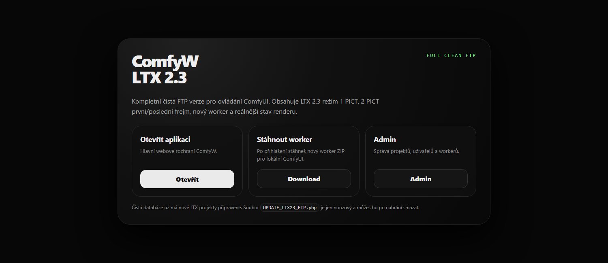

# ComfyWorkerOnline LTX — PZ COMFY VIDEO REMOTE



Self-hosted PHP web panel + local Python worker bridge for ComfyUI / LTX image-to-video workflows.

Webová aplikace v PHP (běží na obyčejném sdíleném hostingu) + Python worker (běží doma na PC s ComfyUI a GPU). Web drží frontu jobů, worker si je stahuje, renderuje v ComfyUI (LTX 2.3 image-to-video) a hotová videa nahrává zpátky na web.

```
┌──────────────┐   HTTPS (API + worker token)   ┌─────────────────────┐
│  Web hosting │ ◄────────────────────────────► │  PC s GPU           │
│  PHP + SQLite│                                │  worker_comfy.py    │
│  fronta jobů │                                │  + ComfyUI (LTX 2.3)│
└──────────────┘                                └─────────────────────┘
```

## Co umí

- Zadávání image-to-video jobů z prohlížeče (1 obrázek = i2v, 2 obrázky = první + poslední frame / FLF2V)
- Fronta s živým stavem renderu, editace pending jobů, rerun, batch upload až 40 obrázků
- Automatický překlad promptu CZ → EN na pozadí (Google GTX s fallbacky)
- Presety kamery, stylu a rozlišení; pokročilé parametry (steps, CFG, motion strength, seed režimy, Prompt Enhance)
- Více workerů současně (každý PC má vlastní token), výběr cílového PC při odeslání
- Admin panel: správa uživatelů (role admin/user) a projektů/workflow
- Bezpečnostní stránka: kontrola .htaccess ochran, správa worker tokenů
- Generování worker ZIPu přímo z webu — stáhneš, rozbalíš na PC s ComfyUI a spustíš

## Struktura souborů (vysvětlivky)

| Soubor / složka | K čemu je |
|---|---|
| `app.php` | Hlavní aplikace — login, formulář nového jobu, fronta, detail jobu |
| `api.php` | Celé REST API (login, joby, dashboard, worker endpointy, překlad…) |
| `admin.php` | Admin panel — uživatelé a projekty/workflow |
| `security.php` | Bezpečnostní přehled + správa worker tokenů (jen admin) |
| `config.example.php` | **Vzor konfigurace.** Zkopíruj jako `config.php` a vyplň (viz níže) |
| `install.php` | Jednorázová instalace — vytvoří SQLite DB a admin účet. **Po instalaci SMAZAT!** |
| `index.php` / `index.html` | Vstupní/landing stránka |
| `comfy.php` | Alias na `app.php` |
| `download_worker.php` | Vygeneruje worker ZIP s čerstvým tokenem (vyžaduje přihlášení) |
| `download_installer.php` | Stažení instalačního balíčku z `downloads/` |
| `worker_comfy.py` | Python worker — běží na PC s ComfyUI, bere joby z API a renderuje |
| `START_LOCAL_WINDOWS.bat` / `start_local_mac_linux.sh` | Lokální spuštění (PHP built-in server) pro vývoj |
| `workflows/` | ComfyUI API workflow šablony (LTX 2.3 i2v + FLF2V) |
| `project_workflows/` | Definice projektů pro auto-import do DB |
| `cache/`, `tmp/`, `tmp_worker/` | Runtime cache a dočasné soubory (v gitu jen prázdné) |
| `uploads/` | Vstupní obrázky (servírují se jen přes API, složka je blokovaná) |
| `outputs/` | Hotová videa (musí být přímo dostupná kvůli přehrávání) |
| `downloads/` | Generované ZIP balíčky (v gitu prázdné) |
| `docs/` | Vývojářské poznámky k jednotlivým verzím a opravám (česky) |
| `tools/` | Pomocné testovací skripty (screenshoty, swipe test) |
| `.htaccess` | Blokuje config, DB, šablony, poznámky a skripty před přímým přístupem |

## Instalace na hosting (FTP)

1. Nahraj celý obsah repa na hosting (potřeba PHP 8+ s `pdo_sqlite`; Apache s `.htaccess`).
2. Zkopíruj `config.example.php` → `config.php` a vyplň:
   - `LOGIN_USERNAME` — tvoje přihlašovací jméno,
   - `LOGIN_PASSWORD_HASH` — bcrypt hash hesla (návod v komentáři souboru),
   - `WORKER_TOKEN_PEPPER` — vlastní náhodný řetězec (návod tamtéž).
3. Otevři v prohlížeči `install.php` — vytvoří databázi a admin účet.
4. **Smaž `install.php` z FTP.** Je nechráněný a každé otevření resetuje uživatele!
5. Přihlas se na `app.php` a zkontroluj `security.php`, že všechny ochrany hlásí OK.

## Spuštění workeru (PC s ComfyUI)

1. Na PC spusť ComfyUI (výchozí `http://127.0.0.1:8000`, případně uprav port v .bat).
2. V aplikaci klikni na **Worker → Stáhnout worker ZIP** — balíček má v sobě čerstvý token.
3. Rozbal a spusť `start_comfy_worker_*.bat` (Windows) nebo ekvivalent pro Linux/Mac.
4. Worker se ohlásí webu (na dashboardu se objeví jako online) a začne brát joby.

Worker komunikuje jen směrem ven (HTTPS polling), takže nepotřebuje veřejnou IP ani otevřené porty. Token se posílá výhradně hlavičkou `X-API-Token`, na serveru je uložen jen jeho HMAC hash.

## Bezpečnost

- Heslo jen jako bcrypt hash v `config.php` (který je v `.gitignore` a blokovaný `.htaccess`).
- CSRF tokeny na všech zápisových akcích, secure session cookie (HttpOnly, SameSite=Lax), HSTS na HTTPS.
- Rate limit na login (12 pokusů / 15 min / IP) i na vytváření jobů.
- Worker tokeny: vlastní token pro každý stažený ZIP, expirace 180 dní, možnost revokace v `security.php`.
- Hotové/chybové joby se automaticky mažou po 48 h (`AUTO_PURGE_FINISHED_AFTER_HOURS`).
- `.htaccess` blokuje přímý přístup k DB, configu, workflow JSONům, poznámkám i skriptům.

**Tento veřejný repozitář neobsahuje žádná hesla, hashe, peppery, tokeny, databázi ani vygenerovaný obsah** — viz [SECURITY.md](SECURITY.md).

## Lokální vývoj

`START_LOCAL_WINDOWS.bat` (resp. `start_local_mac_linux.sh`) spustí PHP built-in server nad aktuální složkou. I lokálně je potřeba vyplněný `config.php` a proběhlý `install.php`.

## Licence

MIT pro aplikační obal, pokud konkrétní soubor neuvádí jinak. ComfyUI, LTX a modely třetích stran mají vlastní licence a podmínky.
